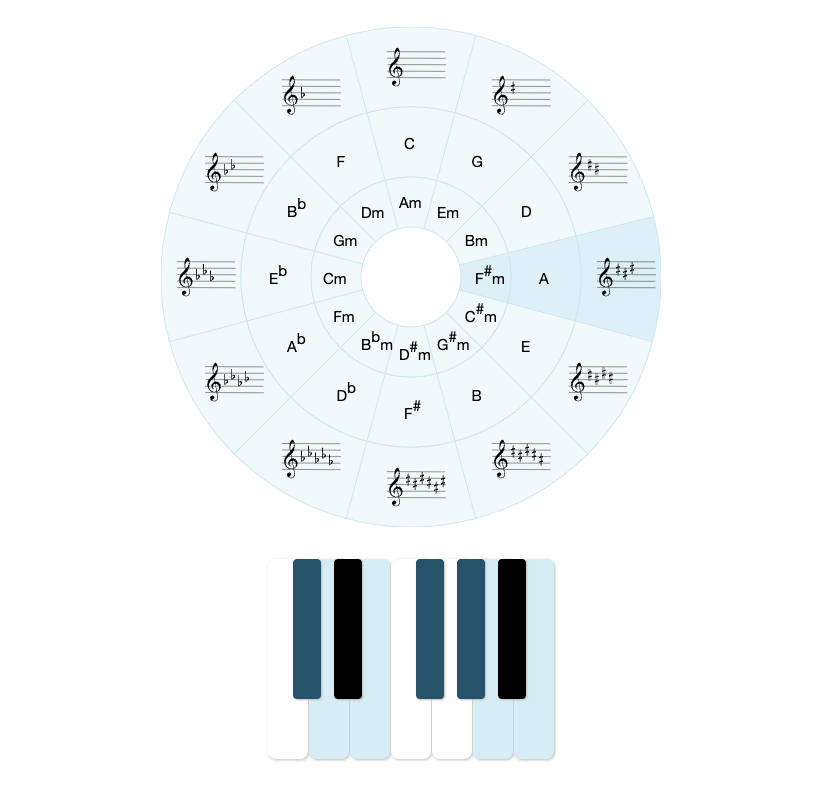

# Interactive circle of fifths
The purpose of this project is to simply create a circle of fifths, which highlights keys belonging to each of the scales. I've used VanJS (minimalistic reactive js framework) with Skeleton (minimalistic css framework). Circle of fifths was created based on a tutorial by LogRocket, available [here](https://blog.logrocket.com/interactive-svg-circle-of-fifths/). Article was written by [Mads Stoumann](https://blog.logrocket.com/author/madsstoumann/) and inspired by this [poster](https://detkuloerteudvalg.dk/vare/det-kuloerte-udvalg-kvintcirklen-plakat/).

### Dependencies
- [Skeleton framework](https://github.com/skeleton-framework/skeleton-framework)
  - [MIT LICENSE](https://github.com/skeleton-framework/skeleton-framework/blob/master/LICENSE)
- [VanJS framework](https://github.com/vanjs-org/van)
  - [MIT LICENSE](https://github.com/vanjs-org/van/blob/main/LICENSE)
